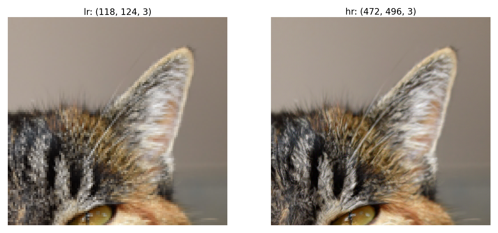
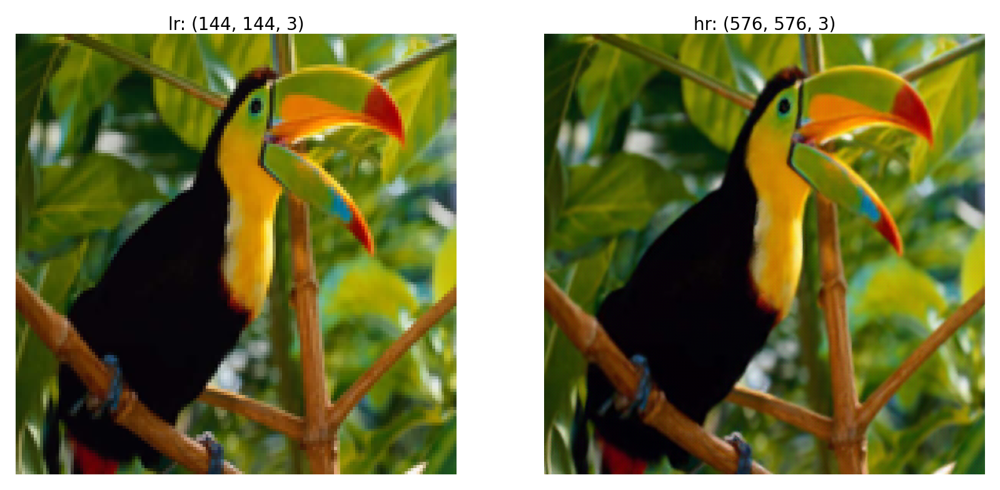

# ESRGAN_TF2

Tensorflow 2.0 implementation of ["ESRGAN: Enhanced Super-Resolution Generative Adversarial Networks"](https://arxiv.org/abs/1809.00219)

## Architecture

RRDB: Residual-in-Residual Dense Block net

RDB: Residual Dense Block (Basic Block)

## Results

## Reference

The work is not built from scratch. Great appreciation to these open works

[1] https://github.com/fenghansen/ESRGAN-Keras

[2] https://github.com/peteryuX/esrgan-tf2
